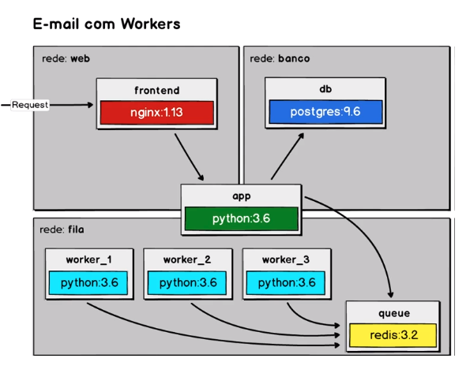
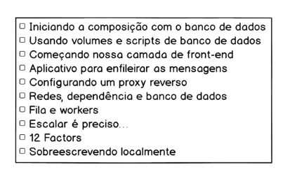
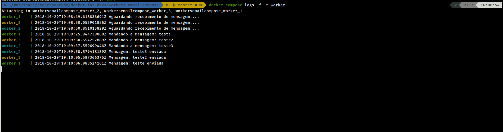
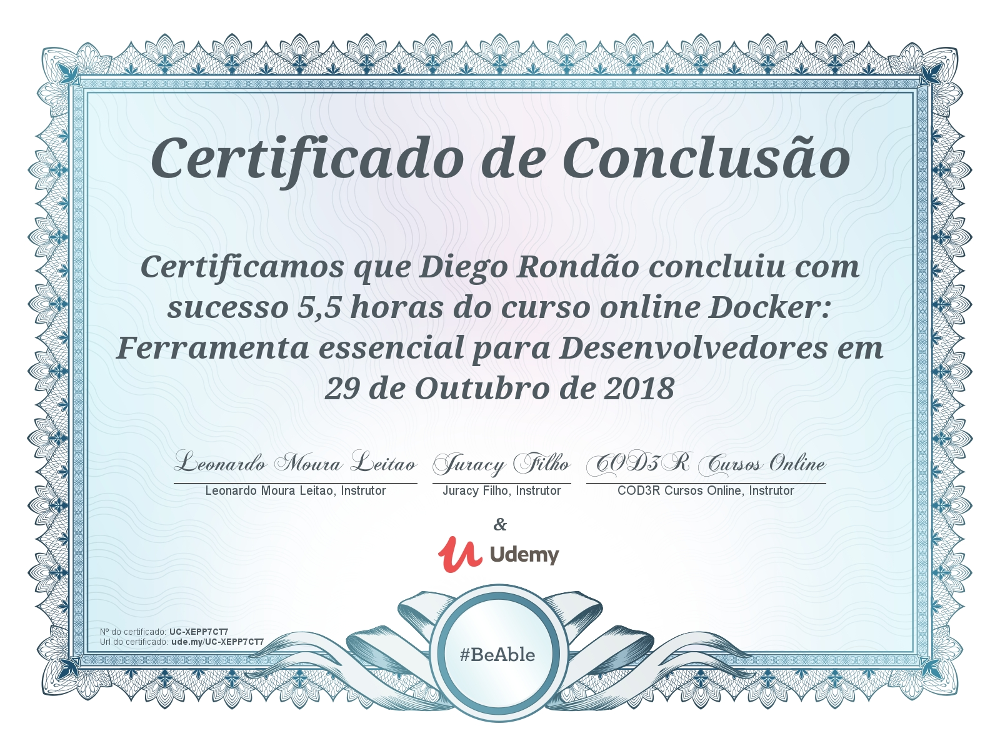

# Docker: Ferramenta essencial para desenvolvedores

## Sobre

* Projeto criado com intuito acadêmico.
* Ele é apenas um material de estudo e não deve ser usado em produção.

## Referência
* [Docker: Ferramenta essencial para desenvolvedores](https://www.udemy.com/curso-docker/)

## Projeto

  
  

  
  

* Workers.

  
  

## Certificado de conclusão

  
  

## Instalação

Para instalar é simples, apenas baixe utilizando o botão Download ZIP ai do lado, ou clone este repositório.

